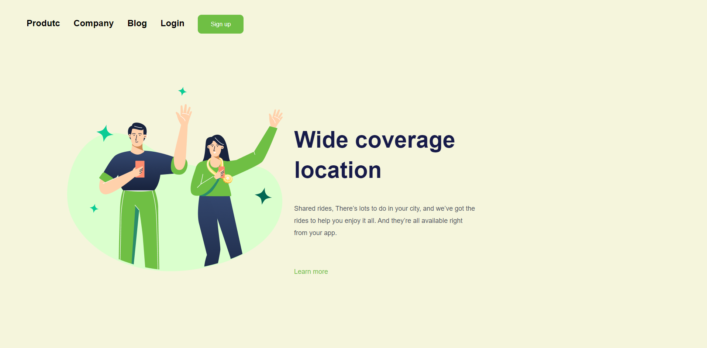

# 🌐 Página Web - Desafio 01

Este projeto é uma página web simples que apresenta um cabeçalho com links de navegação, um botão de inscrição, e uma seção de conteúdo principal com texto e uma imagem.

## 📄 Descrição

A página inclui:
- Um cabeçalho com links para "Product", "Company", "Blog" e "Login".
- Um botão de inscrição "Sign up".
- Uma seção de conteúdo com um título, um parágrafo e uma imagem.

## 🚀 Tecnologias Utilizadas

- HTML5
- CSS3

## 📂 Estrutura do Projeto

- `index.html` - Arquivo principal do projeto.
- `styles.css` - Arquivo de estilos do projeto.
- `img/` - Pasta contendo as imagens utilizadas na página.

## 🖼️ Screenshot

Descrição da imagem: Captura de tela da página web com cabeçalho, botão de inscrição, título, parágrafo e uma imagem.

## 🎨 Estilos CSS

Os estilos são definidos no arquivo `styles.css` e incluem:
- Classes para estilizar o corpo do documento.
- Estilos para o cabeçalho e os links de navegação.
- Estilos para o botão de inscrição.
- Estilos para a seção de conteúdo principal, incluindo o título, parágrafo e imagem.

## 📧 Contato

Se você tiver alguma dúvida ou sugestão, sinta-se à vontade para entrar em contato comigo através do [LinkedIn](https://www.linkedin.com) ou visitar meu [portfólio](https://www.portfolio.com).
